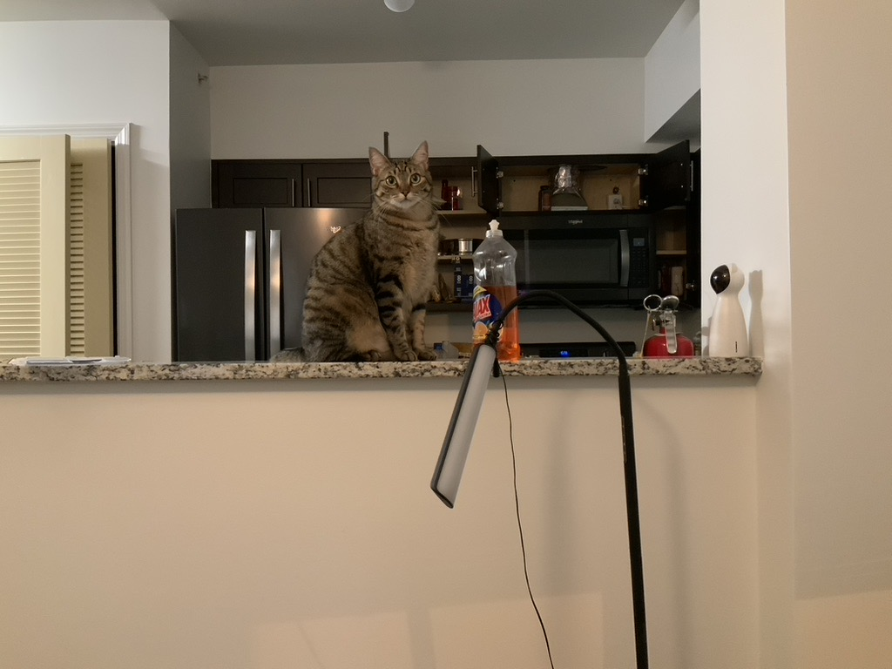
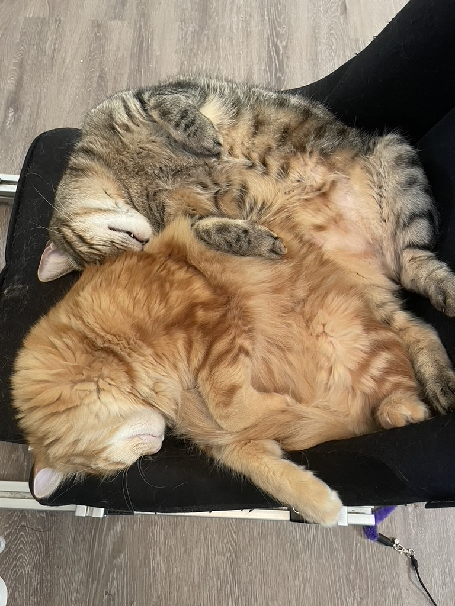

I live with two lovely cats adopted from [Atlanta Humane Society](https://atlantahumane.org/), Gauss and Kolmo. 

I tried to enjoy some sports to stay healthy and live longer. Mountain bike cycling was the one survived and I'm still improving my overall fitness level to be good at it. Although one lesson I learned was it's questionable that if mountain bike riding can really make one live longer not significantly shorter.

I play various kinds of games as well. Base-building games like [Factorio](https://www.factorio.com/) and [Oxygen Not Included](https://store.steampowered.com/app/457140/Oxygen_Not_Included/) are my favorite. I also enjoyed (not anymore) played some e-sport games, like [DotA](https://www.dota2.com/home). I played at a competitive level in DotA at around 7000MMR, which is roughly top 0.5% among the global active players. This journey contributed to my interest of developing a better game matching system. Games helped me to live through some of the hardest time of my life. But now, in the not so hard period of the life, I still play a lot because of addiction. 