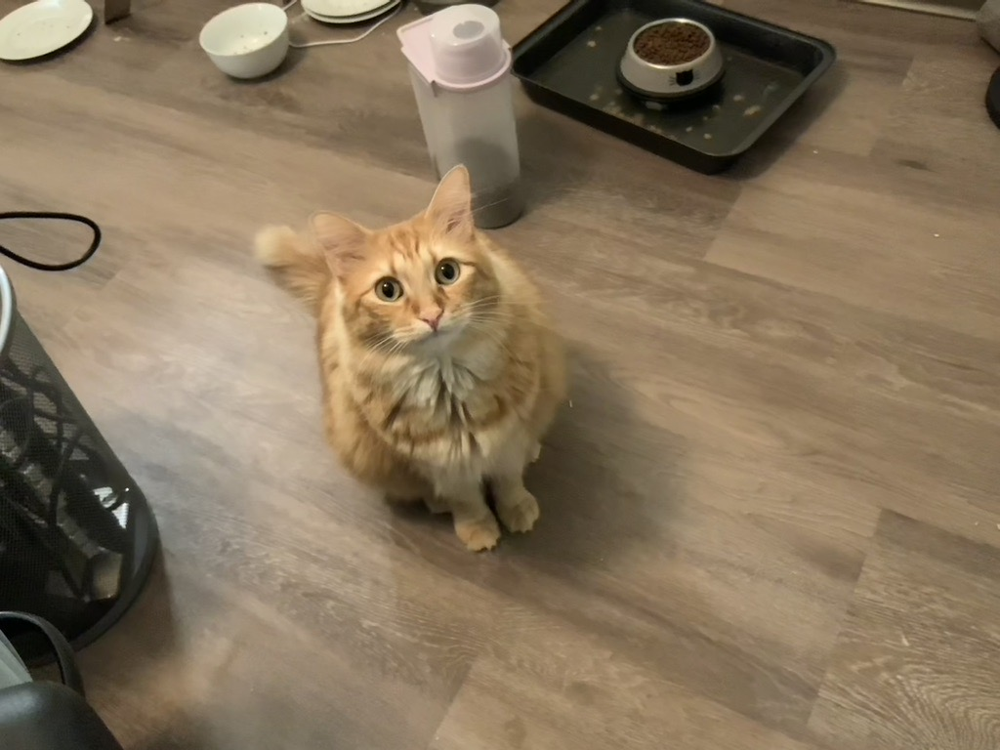

Thanks for your interests in this wonderful, interesting and lovely human being. 
He lives with two equally lovely cats adopted from [Atlanta Humane Society](https://atlantahumane.org/), Gauss and Kolmo. 

Outside work and research, he now enjoys road cycling, mountain biking and running. 

He grew up in Xi'an, a city in central China, the home to Terracotta Army. 
He enjoyed various kinds of games as well, mostly FPS, base-building games, rogue-like, soul-like, farming simulator and driving simulator. 

He also enjoyed playing e-sport titles, like [DotA2](https://www.dota2.com/home) and [Valorant](https://playvalorant.com/en-us/). He started to play DotA in middle school at the age of 15. It was the best place for him to escape to from a very stressful and volatile period of the boy's life. He was consistently within the top 1000 rank leaderboard North and South America combined and probably top 5000 in the world (there's no worldwide leaderboard). This journey contributed to his desire of research in developing a better and more comprehensive game matching/ranking system. He completely quit DotA in 2023 after a 20 loss strike in rank games and countless encounter of toxic behavior. He had enough of it. He switched his attention to Valorant and endurance sports. At the time of writing, he's ranked ascendant in Valorant and a very average weekend warrior cyclist and runner. 

